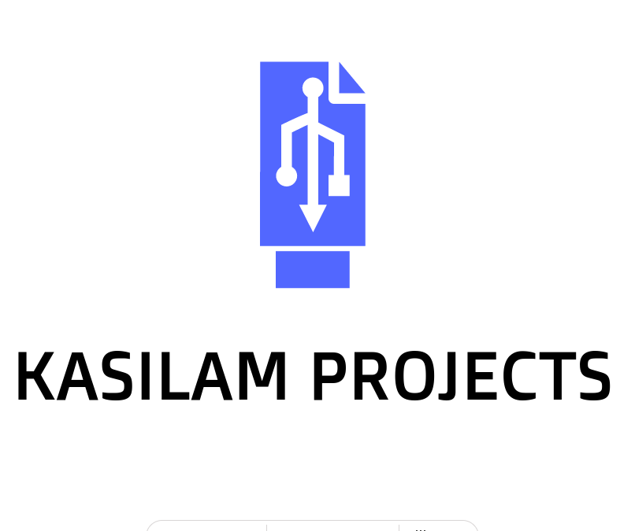

# KasiLam Projects

  

### I'm my attempt to learn stack web development I started these projects that helps townships businesses to have a digital footprints, some of the projects include:

- This projects was built using HTML5, CSS3, Javascript and Jekyll
  > [Photography-Website](https://thabanglukhetho.github.io/Photography/)

- This projects was built using HTML5, CSS3, Javascript
  > [Photography-portfolio-Website](https://realthabanglukhetho.github.io/photography/)
